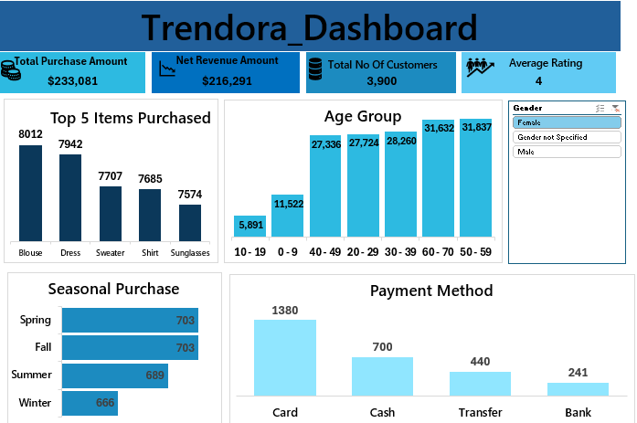
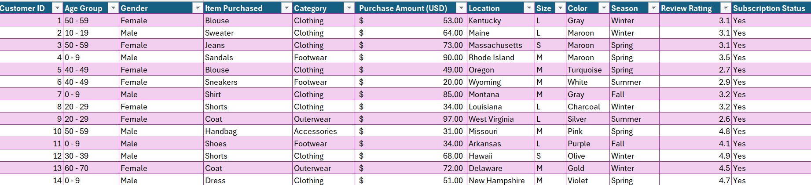

 # Trendora Fashion Growth Analysis
 ### Optimizing Revenue Streams through Demographic Targeting and Seasonal Inventory Management.
 
 
 
 ## Executive Summary
 This report transitions Trendora from reactive reporting to proactive market positioning. By analyzing 3,900 unique customer profiles , we have identified a high-stability revenue core in the 50+ demographic and a significant expansion opportunity within the Gen-Z market. With a current Net Revenue of $216,291, the focus is now on maximizing the lifetime value of current high-spenders while lowering the barrier to entry for new segments.
 
## Strategic Objectives
- Management's shift toward data-driven decision-making aims to resolve three critical business challenges:
- Demographic Optimization: Aligning product inventory with the purchasing power of the most active age groups.
- Payment Ecosystem Stability: Ensuring the highest-converting payment channels (Cards) are prioritized in the digital infrastructure.
- Discount Efficiency: Measuring the ROI of the $16,790 currently allocated to customer discounts.

## Data Integrity & Methodology
### To ensure the reliability of these strategic insights, the raw dataset underwent a rigorous multi-stage cleaning process in Excel:
 - Standardization: Normalized categorical variables, such as Gender and Payment Methods, to eliminate data silos.
 - KPI Engineering: Developed custom metrics for Net Revenue and Average Review Ratings (3.75/5.0) to provide a more accurate picture of business health than gross sales alone.
 - Visualization: Deployed interactive slicers to allow stakeholders to pivot between Gender-specific behaviors in real-time.

## Market Insights & Profit Drivers
 ### A. The "Silver Economy" Advantage
Our analysis reveals that the 50–70 age group is Trendora’s "Power Segment," contributing over $63,000 in total purchases.
 - Insight: Unlike younger segments, these customers show higher price resilience and consistent review engagement.
 ### B. Product Lifecycle & Seasonality
 - Category Leaders: Blouses and Dresses are not just top sellers; they are "Year-Round Essentials".
 - Seasonal Peak: While sales are stable, Spring and Fall see a specific volume increase (703 units each), suggesting these are the optimal windows for new collection launches.
 ### C. Transactional Friction Analysis
 - Payment Dominance: With 1,380 transactions occurring via Card, any technical friction in this gateway represents a direct threat to nearly 60% of potential revenue.

## Strategic Growth Initiatives (Recommendations)
 ### To move Trendora from its current $216k Net Revenue to its next milestone, I recommend the following initiatives:
 - ### Initiative A: The "Loyalty Lock" Program
   - Insight: The 50–70 age demographic contributes the highest revenue ($63k+).
   - Recommendation: Create an exclusive "Silver Tier" loyalty program that offers free express shipping to this group. This protects your most valuable revenue stream from competitors.
  
 - ### Initiative B: Seasonal Inventory Optimization
   - Insight: Spring and Fall are your highest volume seasons (703 units each).
   - Recommendation: Reallocate 20% of the marketing budget from the slower Winter season to heavy promotional "drops" in March (Spring) and September (Fall) to maximize peak-season traffic.

 - ### Initiative C: Payment Friction Reduction
   - Insight: 60% of your customers prefer "Card" payments.
   - Recommendation: Integrate "One-Click" checkout for card users. Since this is your primary payment method, any reduction in checkout time will directly increase the conversion rate of the 3,900 customers in the database.
